# Apa Ilfov Mobile

Aplicatie mobila Flutter pentru clientii Apa-Canal Ilfov. Proiectul genereaza doua aplicatii native din acelasi cod sursa: Android si iOS.

Aplicatia foloseste WebView doar pentru autentificarea in portalul oficial `acilfov.emsys.ro`. Dupa autentificare, ecranele principale sunt native Flutter si citesc datele prin sesiunea reala a portalului, pana cand exista un API oficial ACIlfov.

> **Important - citeste inainte de orice altceva:** acest proiect este neafiliat cu Apa-Canal Ilfov / ACIlfov. A fost construit independent, din nevoie personala, si este oferit catre ACIlfov fara nicio conditie. Termenii completi - statutul legal, ce se ofera, responsabilitatea viitoare si politica de stergere a codului la cerere - sunt in **[TRANSPARENCY.md](TRANSPARENCY.md)**. Licenta software-ului este in **[LICENSE](LICENSE)**.

## Cuprins

- Prezentare proiect
- Capturi de ecran
- Structura proiectului
- Documentatie
- Cerinte locale
- Instalare dupa clone
- Build si test Android
- Build si test iOS
- Cum a fost testata aplicatia (instalare pe device real)
- Publicare Google Play
- Publicare App Store
- Securitate si audit

## Prezentare proiect

Aplicatia include:

- autentificare prin portalul oficial ACIlfov/EMSYS;
- interfata nativa pentru acasa, facturi, plati, consum, index, configurari, contact si informatii cont;
- notificari locale pentru index si facturi scadente, cu verificare automata
  ("caine de paza") care reprogrameaza reamintirile pierdute de telefon si le
  trimite pe cele intarziate de economisirea bateriei;
- fundaluri decorative estompate, cate unul pentru fiecare pagina din meniu;
- stocare securizata pentru cookie-ul de sesiune;
- structura pregatita pentru trecerea la un API oficial cu token cand acesta va fi disponibil.

Sursa activa de date este configurata in `lib/core/config/app_config.dart`:

```dart
static const DataSource dataSource = DataSource.cookie;
```

Valorile disponibile sunt:

| Valoare | Rol |
| --- | --- |
| `DataSource.mock` | Date locale de test pentru dezvoltare si verificare UI. |
| `DataSource.cookie` | Date reale prin sesiunea portalului, fluxul activ in prezent. |
| `DataSource.api` | Pregatit pentru viitorul API oficial ACIlfov. |

## Capturi de ecran

Capturi facute pe simulator iOS, in **modul Review/Demo** (date generate - vezi `AppConfig.reviewDemoEnabled` si tine-apasat pe logo in ecranul de login), ca sa se vada functionalitatea completa fara un cont real ACIlfov.

| | | |
|---|---|---|
| 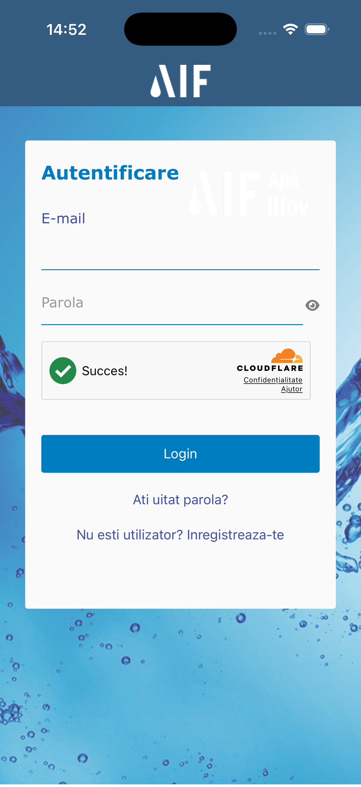 Login (portal real, WebView) | 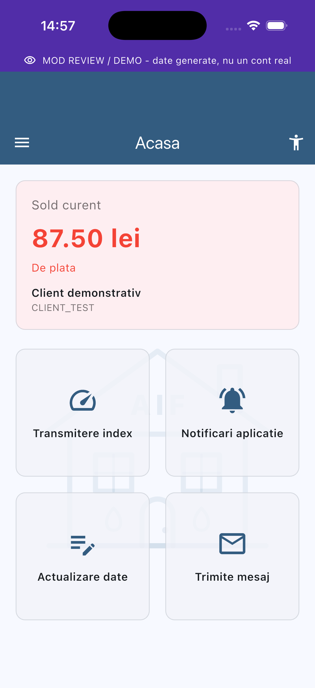 Acasa | 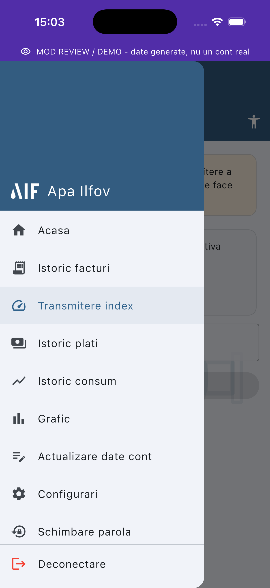 Meniu (1/2) |
| 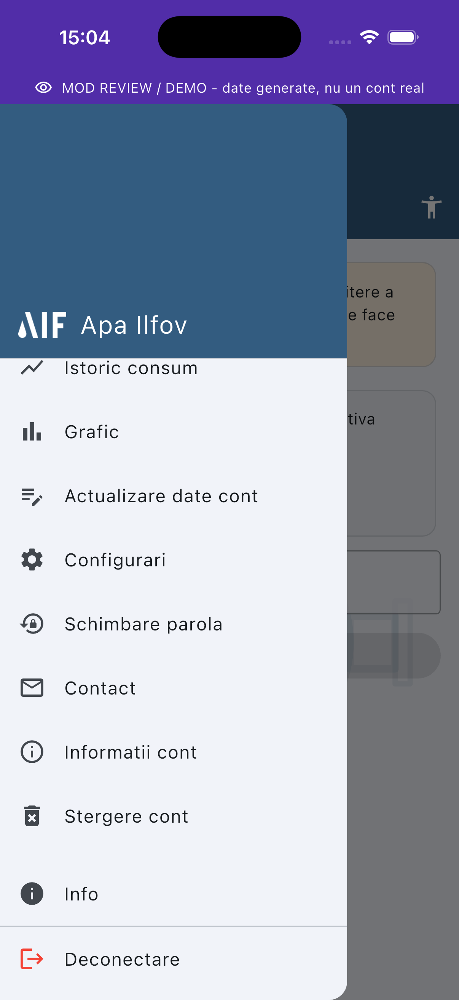 Meniu (2/2) | 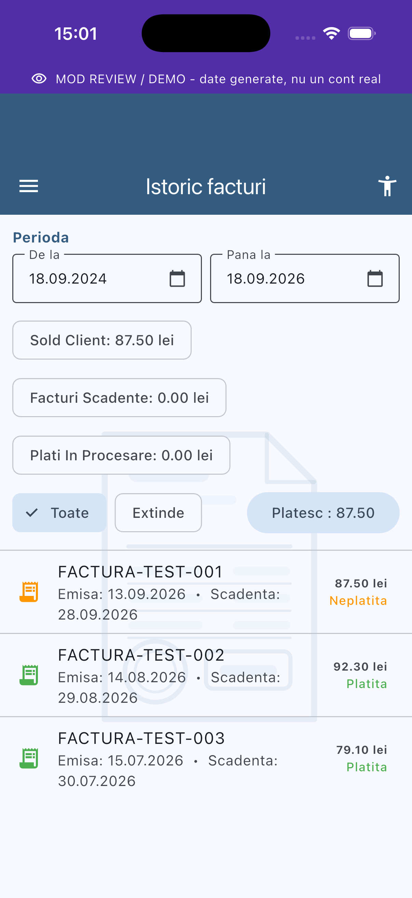 Istoric facturi | 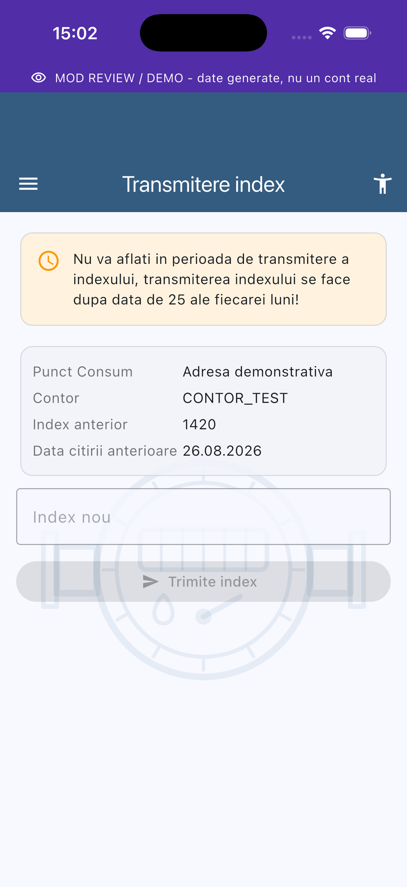 Transmitere index |
| 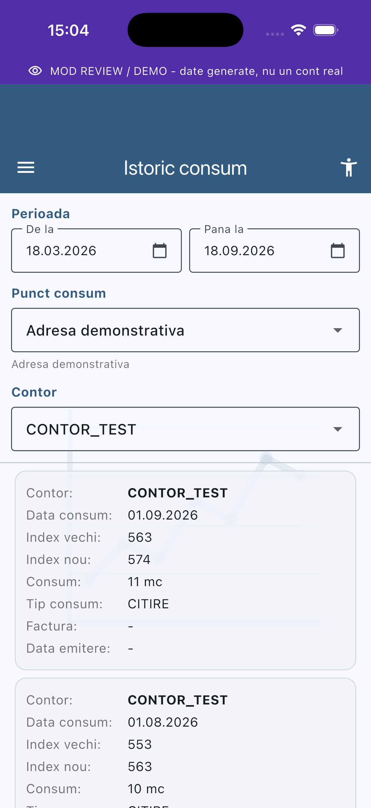 Istoric consum | 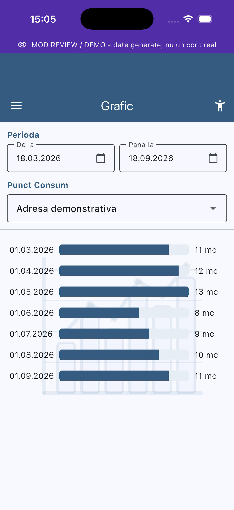 Grafic | 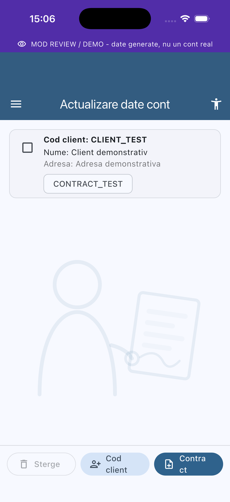 Actualizare date cont |
| 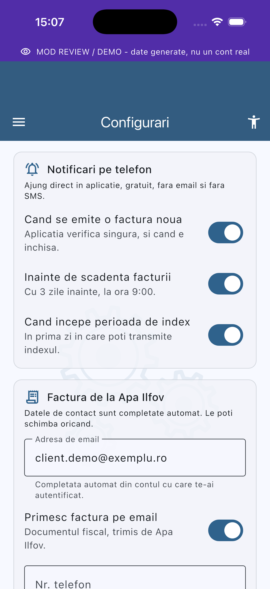 Configurari (1/3) | 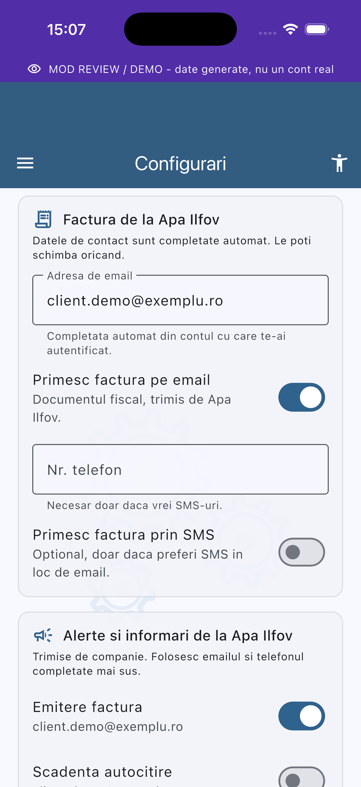 Configurari (2/3) | 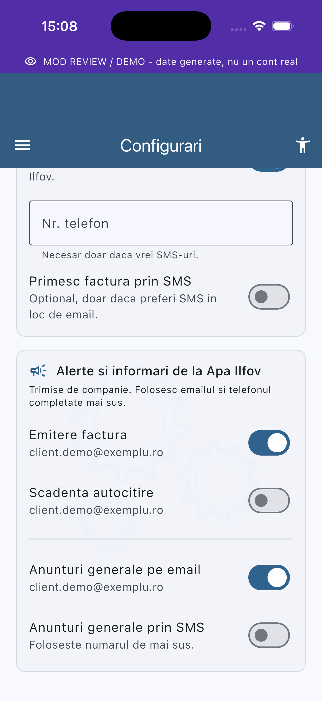 Configurari (3/3) |
| 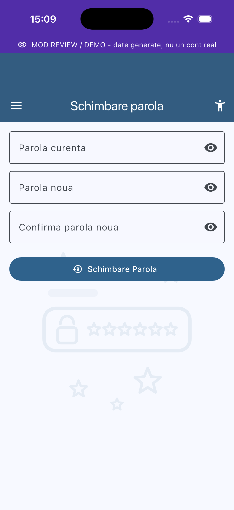 Schimbare parola | 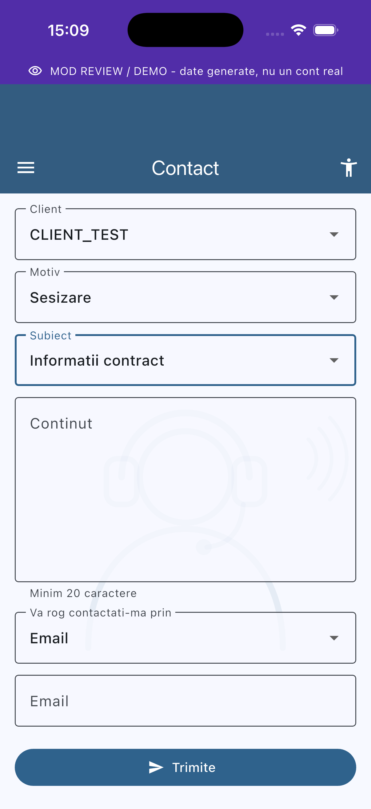 Contact | 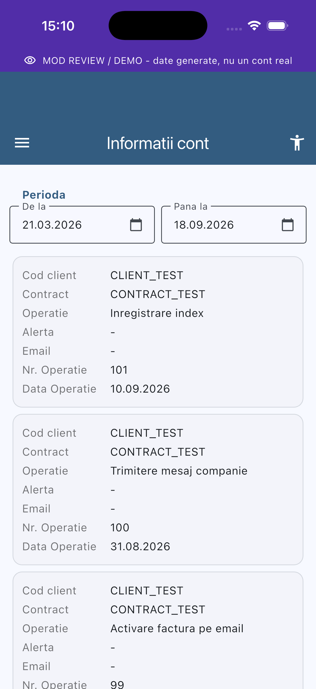 Informatii cont |
| 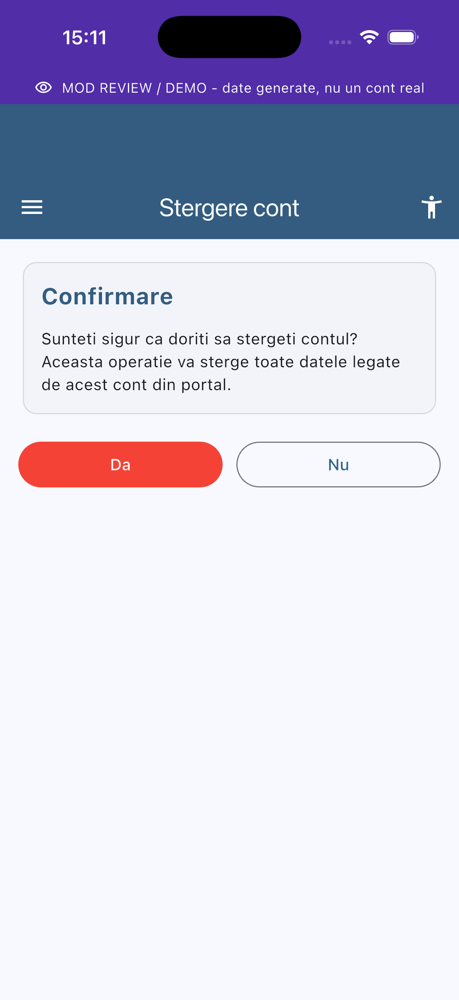 Stergere cont | 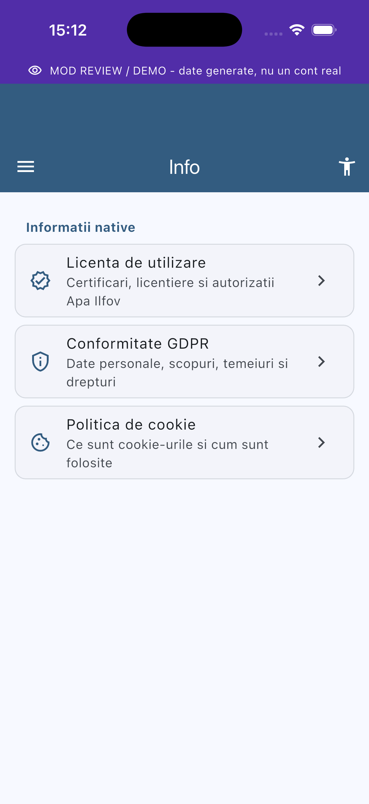 Info | 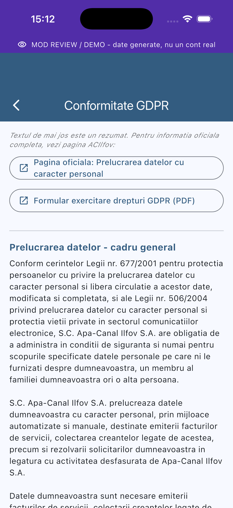 Info - Conformitate GDPR (text oficial + link extern) |

## Structura proiectului

Fisiere si foldere pastrate in root pentru aplicatie si build:

```text
android/                 proiectul nativ Android si configuratia Gradle
ios/                     proiectul nativ iOS, Xcode si CocoaPods
lib/                     codul Flutter al aplicatiei
assets/                  resurse incluse in aplicatie
test/                    teste automate Flutter
pubspec.yaml             dependinte, versiune si asset-uri Flutter
pubspec.lock             versiuni exacte ale dependintelor pentru build reproductibil
analysis_options.yaml    reguli de analiza statica
.metadata                metadata Flutter pentru proiect
.gitignore               reguli pentru fisiere locale si artefacte de build
README.md                documentul principal al proiectului
docs/                    documentatie (arhitectura, propunere API, capturi de ecran)
AUDIT/                   rapoarte de securitate
```

Structura principala din `lib/`:

```text
lib/
  main.dart                         punctul de pornire
  app.dart                          tema si rutarea login/aplicatie
  core/config/app_config.dart       URL-uri, culori si sursa de date
  core/widgets/page_backdrop.dart   desenele decorative din fundalul paginilor
  data/models/                      modelele de date
  data/repositories/                surse mock/cookie/api
  data/sources/                     clienti HTTP pentru portal/API
  data/cookie_store.dart            acces si persistenta cookie sesiune
  data/secure_store.dart            stocare securizata pentru token viitor
  features/                         ecranele aplicatiei
  services/notification_service.dart notificari locale + planul de reamintiri
  services/notification_watchdog.dart verifica si repara reamintirile programate
  state/                            Provider pentru auth si date cont
```

## Documentatie

Rapoartele de audit de securitate sunt in `AUDIT/`:

- `AUDIT/SECURITY_AUDIT.md`
- `AUDIT/MASVS_CHECKLIST.md`
- `AUDIT/THREAT_MODEL.md`
- `AUDIT/PAGES_REAL_API_STATUS.md`

Alta documentatie de proiect, in `docs/`:

- `docs/ARHITECTURA.md` - cum e structurata aplicatia si de ce tranzitia la API-ul oficial e usoara.
- `docs/PROPUNERE-TEHNICA-ACILFOV.md` - propunere tehnica adresata ACIlfov pentru un API de cont, autentificare OAuth 2.0 si tokene read-only pentru integrari personale.
- `docs/screenshots/` - capturile de ecran din sectiunea "Capturi de ecran" de mai sus.

**Notă:** repo-ul a continut anterior un folder `USERCHECK/` cu documente puse deoparte pentru revizuire (inclusiv note de lucru interne, nelegate de functionarea aplicatiei). A fost revizuit si curatat: `ARHITECTURA.md` si `PROPUNERE-TEHNICA-ACILFOV.md` au valoare reala si au fost mutate in `docs/`; restul (note de flux de lucru intre unelte de dezvoltare, un README generat automat de Xcode fara continut util) a fost sters. Vezi `TRANSPARENCY.md` pentru context complet despre acest proiect.

## Cerinte locale

Pentru Android:

- Git;
- Flutter SDK instalat si disponibil in `PATH`;
- Android Studio;
- Android SDK, Android Platform Tools si un emulator configurat;
- Java/JDK furnizat de Android Studio sau configurat separat.

Pentru iOS:

- macOS;
- Flutter SDK;
- Xcode;
- CocoaPods;
- cont Apple Developer pentru instalare pe iPhone real si publicare.

Verificare mediu:

```bash
flutter doctor -v
```

## Instalare dupa clone

Cloneaza repository-ul:

```bash
git clone <URL_REPOSITORY>
cd ACIlfovMobile2
```

Descarca dependintele:

```bash
flutter pub get
```

Ruleaza verificarile de baza:

```bash
flutter analyze
flutter test
```

Regula de testare pe dispozitive: inainte de instalarea unui build nou, dezinstaleaza variantele vechi ale aplicatiei. Pe Android verifica pachetele `ro.acilfov.mobile` si orice identificator vechi folosit in testare.

## Build si test Android

### Debug pe emulator Android

Porneste un emulator din Android Studio sau din terminal:

```bash
flutter emulators
flutter emulators --launch <ID_EMULATOR>
```

Verifica dispozitivele:

```bash
flutter devices
adb devices
```

Dezinstaleaza aplicatia veche din emulator:

```bash
adb -s <DEVICE_ID> shell pm list packages | findstr acilfov
adb -s <DEVICE_ID> uninstall ro.acilfov.mobile
```

Ruleaza aplicatia direct:

```bash
flutter run -d <DEVICE_ID>
```

Sau construieste APK debug pentru emulator:

```bash
flutter build apk --debug --target-platform android-x64
adb -s <DEVICE_ID> install -r build/app/outputs/flutter-apk/app-debug.apk
```

### Debug pe telefon Android real

Activeaza pe telefon `Developer options` si `USB debugging`, apoi conecteaza telefonul prin USB.

```bash
adb devices
adb -s <DEVICE_ID> uninstall ro.acilfov.mobile
flutter build apk --debug --target-platform android-arm,android-arm64
adb -s <DEVICE_ID> install -r build/app/outputs/flutter-apk/app-debug.apk
```

Pentru lansare si loguri:

```bash
adb -s <DEVICE_ID> shell monkey -p ro.acilfov.mobile 1
adb -s <DEVICE_ID> logcat
```

### Release Android pentru test pe telefon

Pentru un build release local:

```bash
flutter clean
flutter pub get
flutter build apk --release --target-platform android-arm,android-arm64
```

APK-ul rezultat:

```text
build/app/outputs/flutter-apk/app-release.apk
```

Instalare pe telefon:

```bash
adb -s <DEVICE_ID> uninstall ro.acilfov.mobile
adb -s <DEVICE_ID> install -r build/app/outputs/flutter-apk/app-release.apk
```

Pentru productie, release-ul trebuie semnat cu keystore de productie/upload key, nu cu debug key.

Configurare semnare Android:

1. Genereaza sau obtine upload keystore-ul.
2. Pune keystore-ul local in `android/app/`, de exemplu `android/app/upload-keystore.jks`.
3. Creeaza `android/key.properties` local, fara sa il comiti:

```properties
storePassword=<PAROLA_STORE>
keyPassword=<PAROLA_KEY>
keyAlias=upload
storeFile=upload-keystore.jks
```

4. Construieste AAB pentru Google Play:

```bash
flutter build appbundle --release --target-platform android-arm,android-arm64
```

Fisierul rezultat:

```text
build/app/outputs/bundle/release/app-release.aab
```

## Build si test iOS

Build-ul iOS se face pe macOS.

### Debug pe simulator iOS

```bash
flutter pub get
flutter devices
flutter run -d <ID_SIMULATOR>
```

Sau build fara rulare:

```bash
flutter build ios --debug --simulator
```

### Test pe iPhone real

1. Conecteaza iPhone-ul la Mac.
2. Deschide workspace-ul iOS:

```bash
open ios/Runner.xcworkspace
```

3. In Xcode intra la `Runner` -> `Signing & Capabilities`.
4. Alege `Team` din contul Apple Developer.
5. Verifica `Bundle Identifier`. Pentru update peste aceeasi aplicatie, pastreaza identificatorul stabilit pentru proiect.
6. Selecteaza iPhone-ul conectat si apasa `Run`.

Daca iPhone-ul cere incredere pentru profilul de developer, intra pe telefon la:

```text
Settings -> General -> VPN & Device Management
```

si apasa `Trust` pentru profilul folosit la semnare.

Build release iOS:

```bash
flutter clean
flutter pub get
flutter build ios --release
```

Pentru IPA:

```bash
flutter build ipa --release
```

IPA-ul este generat in:

```text
build/ios/ipa/
```

## Cum a fost testata aplicatia (instalare pe device real)

Sectiunea asta documenteaza EXACT ce s-a folosit ca sa instalam si sa testam aplicatia pe un iPhone si pe Android reale, wireless, inclusiv problemele intalnite - ca oricine preia proiectul sa poata repeta acelasi test fara sa reinventeze pasii.

### Android, telefon real (USB sau wireless ADB)

```bash
flutter devices                       # confirma ca telefonul apare
flutter run -d <ID_DEVICE> --debug    # instalare + rulare debug
# sau, pentru un build de release:
flutter build apk --release           # esueaza intentionat fara android/key.properties (vezi mai jos)
flutter run -d <ID_DEVICE> --release
```

**De retinut:** de cand semnarea de release a fost intarita (vezi `android/app/build.gradle.kts`), `assembleRelease`/`bundleRelease` esueaza intentionat daca lipseste `android/key.properties` - asta e o protectie, nu un bug; fara ea, un build de productie s-ar putea semna accidental cu cheia de debug.

### iOS, iPhone real, prin retea (wireless, fara cablu)

```bash
flutter devices                                  # sectiunea "wireless devices" arata iPhone-ul, daca a mai fost conectat macar o data prin cablu si activat "Connect via network" din Xcode
flutter run -d "<ID_IPHONE_WIRELESS>" --release   # sau --debug
```

Probleme reale intalnite si cum au fost rezolvate, in ordine:

1. **`pod install` a esuat** cu "requires a higher minimum iOS deployment version" - un plugin (`workmanager_apple`) cere iOS 14+, dar proiectul tinta iOS 13.0. Rezolvat prin ridicarea `IPHONEOS_DEPLOYMENT_TARGET` la 14.0 in `ios/Podfile` si `ios/Runner.xcodeproj/project.pbxproj` (telefoanele reale ruleaza oricum versiuni mult mai noi, deci fara impact practic).
2. **Instalarea a esuat** cu "may need to be unlocked to recover from previously reported preparation errors" - iPhone-ul era blocat. Solutie: telefonul trebuie deblocat (si ideal sa ramana deblocat) cat timp Xcode instaleaza prin retea.
3. **Aplicatia se inchidea instant la deschidere** (release build) - cauza reala, gasita din crash log-urile telefonului (vezi mai jos), a fost ca handler-ul `BGTaskScheduler` pentru verificarea periodica a facturilor nu era inregistrat inainte de `didFinishLaunching`, ceea ce arunca o exceptie Objective-C necapturabila din Dart. Rezolvat in `ios/Runner/AppDelegate.swift` prin apelul `WorkmanagerPlugin.registerPeriodicTask(withIdentifier:)`.

### Verificarea unei aplicatii instalate pe iPhone, de la terminal (fara Xcode deschis)

Utile pentru diagnosticare, mai ales cand aplicatia pare sa se inchida singura:

```bash
xcrun devicectl list devices                                                         # ID-ul device-ului (UDID)
xcrun devicectl device info processes --device <UDID> | grep -i runner               # procesul Runner e viu?
xcrun devicectl device info files --device <UDID> --domain-type systemCrashLogs      # listeaza crash log-urile de pe telefon
xcrun devicectl device copy from --device <UDID> --domain-type systemCrashLogs \
  --source "Runner-<data>.ips" --destination /tmp/crash.ips                          # descarca un crash log anume
xcrun devicectl device process launch --device <UDID> ro.acilfov.mobile              # lanseaza aplicatia manual, fara sa deschizi telefonul
```

Un crash `.ips` descarcat asa e JSON dupa prima linie de header - `asi` (application specific information) si `lastExceptionBacktrace` sunt de obicei suficiente ca sa identifici cauza fara sa reproduci crash-ul intr-un debugger.

## Publicare Google Play

Publicarea se face din Google Play Console.

1. Incrementeaza versiunea in `pubspec.yaml`, de exemplu:

```yaml
version: 2.0.1+2
```

2. Ruleaza verificarile:

```bash
flutter analyze
flutter test
```

3. Configureaza semnarea release in `android/key.properties`.
4. Genereaza AAB:

```bash
flutter build appbundle --release --target-platform android-arm,android-arm64
```

5. Intra in [Google Play Console](https://play.google.com/console).
6. Creeaza aplicatia sau selecteaza aplicatia existenta.
7. Completeaza `Store listing`, screenshots, icon, descriere, categorie si date de contact.
8. Completeaza `App content`: Data safety, privacy policy, target audience, ads, content rating.
9. Intra la `Release` -> `Testing` pentru test intern sau inchis.
10. Incarca fisierul `app-release.aab`.
11. Verifica raportul Play Console si publica intai pe test intern.
12. Dupa validare, promoveaza release-ul catre productie.

## Publicare App Store

Publicarea se face din Apple Developer si App Store Connect.

1. Incrementeaza versiunea in `pubspec.yaml`.
2. In Apple Developer creeaza/verifica `Identifier` pentru bundle id-ul aplicatiei.
3. In Xcode, la `Runner` -> `Signing & Capabilities`, seteaza `Team` si signing automat sau manual.
4. Genereaza build release:

```bash
flutter build ipa --release
```

Sau foloseste Xcode:

```text
Xcode -> Product -> Archive
```

5. In Xcode Organizer apasa `Distribute App` si trimite build-ul catre App Store Connect.
6. Intra in [App Store Connect](https://appstoreconnect.apple.com/).
7. Creeaza aplicatia sau selecteaza aplicatia existenta.
8. Completeaza metadata: nume, subtitlu, descriere, keywords, screenshots, categorie, suport si privacy policy.
9. Completeaza `App Privacy`.
10. Publica intai in TestFlight.
11. Dupa testare, trimite build-ul la App Review pentru publicare.

## Securitate si audit

Aplicatia a fost auditata local pe cod, configuratii Android/iOS si dependinte. Rapoartele sunt in `AUDIT/`:

- `SECURITY_AUDIT.md` - raportul complet de audit;
- `MASVS_CHECKLIST.md` - checklist OWASP MASVS;
- `THREAT_MODEL.md` - modelul de amenintari;
- `PAGES_REAL_API_STATUS.md` - statusul paginilor conectate la date reale.

Rezumat audit:

- nu au fost gasite vulnerabilitati critice sau high in codul curent;
- sesiunea este stocata in secure storage;
- Android are backup dezactivat si cleartext blocat;
- WebView-ul de login are allowlist pe domenii;
- raman recomandari de productie pentru signing release, pinning TLS, forced update, protectie iOS pentru app switcher si versionarea `pubspec.lock`.

## Note operationale

- Inainte de test pe emulator sau telefon real, dezinstaleaza aplicatiile vechi cu acelasi pachet sau cu pachete folosite anterior.
- Pentru emulator Android se folosesc ABI-uri x86/x64.
- Pentru telefoane Android reale se folosesc ABI-uri ARM: `android-arm` si `android-arm64`.
- `android/key.properties`, keystore-urile, certificatele si fisierele `.env` nu se comit in git.
- `pubspec.lock` trebuie pastrat si comis pentru build-uri reproductibile.
